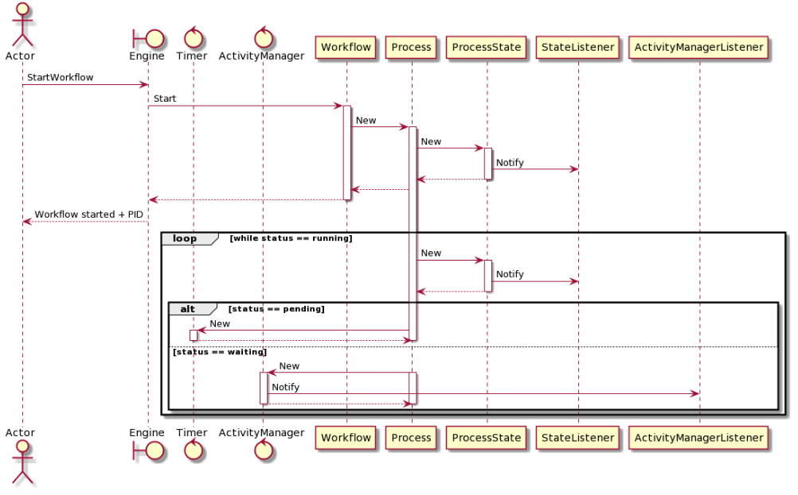

# Ciclo de vida do processo

Nessa página será possível entender como um ciclo de execução da API funciona. 
Visualmente, pode-se observar abaixo o seguinte diagrama de execução: 



## Ciclo Básico

O ciclo básico para a requisição API é composto pela seguinte sequência de processos:

- GET/token
  - token > actor_id
- Inscreve-se em um tópico no WS MQTT
- POST /workflows/name/{workflow_name}/start
  - process_id
- Recebe process_id no tópico
- GET /process/{process_id}
  - activity_manager_id
- GET /process/activityManager/{activity_manager_id}
  - Actions& Props

Para entender um pouco mais do que foi descrito acima, tem-se a seguinte explicação:

- Antes de realizar qualquer ação, é necessária uma autenticação, que pode ser feita através de um token, por exemplo;
- Após isso, é feita uma inscrição em um tópico no protocolo MQTT;
- A partir desse ponto, o processo é iniciado e um ```process_id``` é retornado;
- O tópico MQTT irá receber esse processo;
- O processo será chamado e ficará nesse ciclo até que uma atividade seja requerida, o que irá retornar um ```activity_manager_id```;
  - Antes de prosseguir, é necessário explicar alguns pontos do ```activity_manager```: 
  - O ```activity_manager``` é composto por uma ```action``` e por um ```props```, que são:
    - ```action```: O que será feito/Tarefa a ser executada
    - ```props```: Dados necessários para a execução
- Quando o processo chega nesse estado, são realizados Submits em suas chamadas;
- Nesse ponto o processo continuará rodando até que outro ```activity_manager``` seja retornado, ficando nesse processo até ele ser encerrado.


