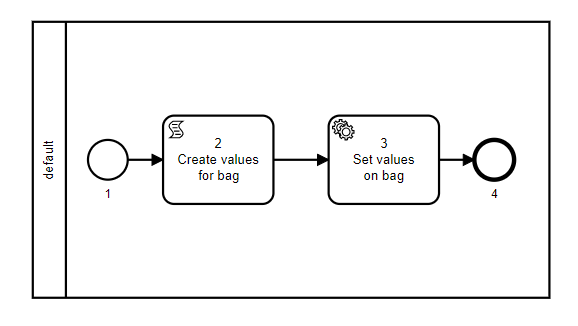

# bag_example

## Descrição

   Este exemplo tem como objetivo mostrar como criar e incluir os dados em uma bag.
   
   A regra utilizada para nomear os nós nesse exemplo é a [Sequência númerica](resources/name_nodes/sequenciaNumerica).

   + ** Nó 1 ** - Sempre se inicia o [processo](documentation/processos.md) com um [nó](resources/blueprints.mdx) tipo [Start](resources/nodes/startNode.mdx). 
   
   Nesse exemplo não há [parâmetros](resources/blueprints.mdx) pré-definidos para esse nó. Ou seja, o objeto **input_schema** é vazio.

   + ** Nó 2 ** - É um [nó](resources/blueprints.mdx) tipo [ScriptTask](resources/nodes/scriptNode.mdx). 

   Analisando o objeto [parameters](resources/blueprints.mdx) no item **function** as variáveis **example** e **value** são criadas e recebem respectivamente os valores **bag_example** e **bag_value**.

   + ** Nó 3 ** - O [nó](resources/blueprints.mdx) 3 é tipo [SystemTask](resources/nodes/systemTask.mdx) categoria **Set To bag**.
   Nesse nó os objetos **example** e **valueResult** são incluídos na bag.

   Os dados na bag se tornam diponíveis para os nós a frente. 

   + ** Nó 4 ** - o [nó](resources/blueprints.mdx) 4 é um [Finish Node](resources/nodes/finishNode.mdx) encerrando o processo.
## Diagrama



## Blueprint

```js title="bag_example"

{
   "name":"bag_example",
   "description":"",
   "blueprint_spec":{
      "requirements":[
         "core"
      ],
      "prepare":[
         
      ],
      "nodes":[
         {
            "id":"1",
            "type":"Start",
            "name":"Start node",
            "parameters":{
               "input_schema":{
                  
               }
            },
            "next":"2",
            "lane_id":"1"
         },
         {
            "id":"2",
            "type":"ScriptTask",
            "name":"Create values for bag",
            "next":"3",
            "lane_id":"1",
            "parameters":{
               "input":{
                  
               },
               "script":{
                  "package":"",
                  "function":[
                     "fn",
                     [
                        "&",
                        "args"
                     ],
                     {
                        "example":"bag_example",
                        "value":"bag_value"
                     }
                  ]
               }
            }
         },
         {
            "id":"3",
            "type":"SystemTask",
            "category":"SetToBag",
            "name":"Set values on bag",
            "next":"4",
            "lane_id":"1",
            "parameters":{
               "input":{
                  "example":{
                     "$ref":"result.example"
                  },
                  "valueResult":{
                     "$ref":"result.value"
                  }
               }
            }
         },
         {
            "id":"4",
            "type":"Finish",
            "name":"Finish node",
            "next":null,
            "lane_id":"1"
         }
      ],
      "lanes":[
         {
            "id":"1",
            "name":"default",
            "rule":["fn", ["&", "args"], true]
         }
      ],
      "environment":{
         
      }
   }
}


```