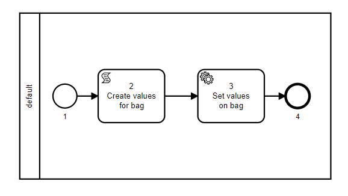

# Exemplos

A seguir, serão apresentados uma série de exemplos com as suas respectivas blueprints. 

## bag_example




```js title="bag_example.js"
const lisp = require("../src/core/lisp");
const settings = require("../settings/settings");
const { Engine } = require("../src/engine/engine");
const startEventListener = require("../src/core/utils/eventEmitter");
const emitter = require("../src/core/utils/emitter");

const blueprint_spec = {
  requirements: ["core"],
  prepare: [],
  nodes: [
    {
      id: "1",
      type: "Start",
      name: "Start node",
      parameters: {
        input_schema: {},
      },
      next: "2",
      lane_id: "1"
    },
    {
      id: "2",
      type: "ScriptTask",
      name: "Create values for bag",
      next: "3",
      lane_id: "1",
      parameters: {
        input: {},
        script: {
          package: "",
          function: [
            "fn",
            ["&", "args"],
            {
              example: "bag_example",
              value: "bag_value",
            },
          ],
        },
      }
    },
    {
      id: "3",
      type: "SystemTask",
      category: "SetToBag",
      name: "Set values on bag",
      next: "4",
      lane_id: "1",
      parameters: {
        input: {
          example: {"$ref": "result.example"},
          valueResult: {"$ref": "result.value"}
        }
      }
    },
    {
      id: "4",
      type: "Finish",
      name: "Finish node",
      next: null,
      lane_id: "1"
    }
  ],
  lanes: [
    {
      id: "1",
      name: "default",
      rule: lisp.return_true()
    }
  ],
  environment: {},
};

const actor_data = {
  id: "1",
  claims: []
};
startEventListener(emitter);

const run_example = async() => {
  const engine = new Engine(...settings.persist_options);
  emitter.emit('info', "===  RUNNING bag_example  ===");
  const workflow = await engine.saveWorkflow("bag_example", "bag showcase", blueprint_spec);
  const process = await engine.createProcess(workflow.id, actor_data);
  const process_id = process.id;
  await engine.runProcess(process_id, actor_data);
  const state_history = await engine.fetchProcessStateHistory(process_id);
  return state_history;
}

run_example().then(res => { emitter.emit(res); });
```
## channel_restriction


```js title="channel_restriction.js"
const readlineSync = require("readline-sync");
const lisp = require("../src/core/lisp");
const settings = require("../settings/settings");
const { Engine } = require("../src/engine/engine");
const startEventListener = require("../src/core/utils/eventEmitter");
const emitter = require("../src/core/utils/emitter");

const blueprint_spec = {
    requirements: ["core"],
    prepare: [],
    nodes: [
        {
            id: "1",
            type: "Start",
            name: "Start node",
            parameters: {
                input_schema: {},
            },
            next: "2",
            lane_id: "1"
        },
        {
            id: "2",
            type: "UserTask",
            name: "User task node",
            next: "99",
            lane_id: "1",
            parameters: {
                action: "userAction",
                channels: ["1", "2"],
                input: {}
            }
        },
        {
            id: "99",
            type: "Finish",
            name: "Finish node",
            next: null,
            lane_id: "1"
        }
    ],
    lanes: [
        {
            id: "1",
            name: "default",
            rule: lisp.return_true()
        }
    ],
    environment: {},
};

const actor_data = {
    id: "1",
    claims: []
};

const actor_data_channel_3 = {
    id: "2",
    claims: [],
    channel: "3",
}

const actor_data_channel_1 = {
    id: "3",
    claims: [],
    channel: "1",
}

startEventListener(emitter);

const run_example = async () => {
    emitter.emit("===  RUNNING channel_restriction_example  ===");
    const engine = new Engine(...settings.persist_options);
    const workflow = await engine.saveWorkflow("user_task_example", "user task showcase", blueprint_spec);
    const process = await engine.createProcess(workflow.id, actor_data);
    const process_id = process.id;
    await engine.runProcess(process_id, actor_data);

    emitter.emit("=== Activity manager without channel ===");
    try {
        const activityManager = await engine.fetchAvailableActivityForProcess(process_id, actor_data);
        emitter.emit("Activity Manager: ", activityManager);
    } catch (error) {
        emitter.emit("Error get activityManager");
    }

    emitter.emit("=== Activity manager with channel 3 ===");
    try {
        const activityManager = await engine.fetchAvailableActivityForProcess(process_id, actor_data_channel_3);
        emitter.emit("Activity Manager: ", activityManager);
    } catch (error) {
        emitter.emit("Error get activityManager");
    }

    emitter.emit("=== Activity manager with channel 1 ===");
    const activityManager = await engine.fetchAvailableActivityForProcess(process_id, actor_data_channel_1);
    emitter.emit("Activity Manager: ", activityManager);
}

run_example();
```

## flow_example


```js title="flow_example.js"
const lisp = require("../src/core/lisp");
const settings = require("../settings/settings");
const { Engine } = require("../src/engine/engine");
const startEventListener = require("../src/core/utils/eventEmitter");
const emitter = require("../src/core/utils/emitter");

const blueprint_spec = {
  requirements: ["core"],
  prepare: [],
  nodes: [
    {
      id: "1",
      type: "Start",
      name: "Start node",
      parameters: {
        input_schema: {},
      },
      next: "2",
      lane_id: "1"
    },
    {
      id: "2",
      type: "ScriptTask",
      name: "Create values for bag",
      next: "3",
      lane_id: "1",
      parameters: {
        input: {},
        script: {
          package: "",
          function: [
            "fn",
            ["&", "args"],
            [
              "set",
              {
                name: "valueExample",
                extraData: 98,
              },
              ["`", "value"],
              [
                "js",
                [
                  ".",
                  "Math",
                  ["`", "floor"],
                  [
                    "*",
                    [".", "Math", ["`", "random"]],
                    [".", "Math", ["`", "floor"], 3],
                  ],
                ],
              ],
            ],
          ],
        },
      }
    },
    {
      id: "3",
      type: "Flow",
      name: "Set values on bag",
      next: {
        1: "2",
        default: "4",
      },
      lane_id: "1",
      parameters: {
        input: {
          decision: {
            $ref: "result.value"
          }
        }
      }
    },
    {
      id: "4",
      type: "Finish",
      name: "Finish node",
      next: null,
      lane_id: "1"
    }
  ],
  lanes: [
    {
      id: "1",
      name: "default",
      rule: lisp.return_true()
    }
  ],
  environment: {},
};

const actor_data = {
  id: "1",
  claims: []
};

startEventListener(emitter);

const run_example = async() => {
  emitter.emit("===  RUNNING flow_example  ===");
  const engine = new Engine(...settings.persist_options);
  const workflow = await engine.saveWorkflow("bag_example", "bag showcase", blueprint_spec);
  const process = await engine.createProcess(workflow.id, actor_data);
  const process_id = process.id;
  await engine.runProcess(process_id, actor_data);
  const state_history = await engine.fetchProcessStateHistory(process_id);
  return state_history;
}

run_example().then(res => { emitter.emit(res); });
```

## forca


```js title="forca.js"
const readlineSync = require("readline-sync");
const lisp = require("../src/core/lisp");
const settings = require("../settings/settings");
const { Engine } = require("../src/engine/engine");
const startEventListener = require("../src/core/utils/eventEmitter");
const emitter = require("../src/core/utils/emitter");

const blueprint_spec = {
  requirements: ["core"],
  prepare: [],
  nodes: [
    {
      id: "1",
      type: "Start",
      name: "Start node",
      parameters: {
        input_schema: {},
      },
      next: "2",
      lane_id: "1"
    },
    {
      id: "2",
      type: "ScriptTask",
      name: "Generate initial values",
      next: "3",
      lane_id: "1",
      parameters: {
        input: {},
        script: {
          function: [
            "fn",
            ["&", "args"],
            [
              "let",
              [
                "index",
                [
                  "js",
                  [
                    ".",
                    "Math",
                    ["`", "floor"],
                    [
                      "*",
                      [".", "Math", ["`", "random"]],
                      [".", "Math", ["`", "floor"], 3],
                    ],
                  ],
                ],
                "words",
                [
                  "list",
                  ["`", "test"],
                  ["`", "game"],
                  ["`", "example"],
                ],
                "word",
                ["nth", "words", "index"],
                "state",
                [
                  "js",
                  [
                    "str",
                    ["`", "let word = '"],
                    "word",
                    ["`", "';word.replace(/./g, '_');"],
                  ],
                ],
              ],
              [
                "set",
                [
                  "set",
                  {
                    errorCount: 0,
                    isPrivate: true,
                  },
                  ["`", "state"],
                  "state"
                ],
                ["`", "word"],
                "word"
              ]
            ],
          ],
        },
      }
    },
    {
      id: "3",
      type: "SystemTask",
      category: "SetToBag",
      name: "Set initial values to the bag",
      next: "4",
      lane_id: "1",
      parameters: {
        input: {
          word: {"$ref": "result.word"},
          state: {"$ref": "result.state"},
          errorCount: {"$ref": "result.errorCount"},
          isPrivate: {"$ref": "result.isPrivate"}
        }
      },
    },
    {
      id: "4",
      type: "UserTask",
      name: "User input letter",
      next: "5",
      lane_id: "1",
      parameters: {
        action: "letterInput",
        input: {
          state: {"$ref": "bag.state"},
          errorCount: {"$ref": "bag.errorCount"},
          isPrivate: {"$ref": "bag.isPrivate"}
        }
      },
    },
    {
      id: "5",
      type: "ScriptTask",
      name: "test",
      next: "6",
      lane_id: "1",
      parameters: {
        input: {
          userInput: {"$ref": "result.activities[0]"},
          creatorId: {"$ref": "bag.creatorId"}
        },
        script: {
          function: [
            "fn",
            ["input", "&", "args"],
            [
              "let",
              [
                "inputData",
                [
                  "get",
                  ["get", "input", ["`", "userInput"]],
                  ["`", "data"],
                ],
                "letter",
                [
                  "get",
                  "inputData",
                  ["`", "letter"]
                ],
                "changePermission",
                [
                  "if",
                  [
                    "=",
                    ["get", "input", ["`", "creatorId"]],
                    ["get", "inputData", ["`", "actorId"]]
                  ],
                  true,
                  false
                ]
              ],
              [
                "set",
                [
                  "set",
                  {},
                  ["`", "inputType"],
                  [
                    "if",
                    ["null?", "letter"],
                    [
                      "if",
                      "changePermission",
                      ["`", "changePermission"],
                      ["`", "unauthorized"],
                    ],
                    ["`", "letterInput"],
                  ],
                ],
                ["`", "letterInput"],
                "letter"
              ]
            ]
          ]
        }
      },
    },
    {
      id: "6",
      type: "SystemTask",
      category: "SetToBag",
      name: "Set input letter on bag",
      next: "7",
      lane_id: "1",
      parameters: {
        input: {
          letterInput: {"$ref": "result.letterInput"},
          inputType: {"$ref": "result.inputType"}
        }
      }
    },
    {
      id: "7",
      type: "Flow",
      name: "Control change permission or letter input",
      next: {
        unauthorized: "4",
        changePermission: "8",
        letterInput: "10",
        default: "4",
      },
      lane_id: "1",
      parameters: {
        input: {
          inputType: {"$ref": "result.inputType"}
        }
      }
    },
    {
      id: "8",
      type: "ScriptTask",
      name: "Change permission",
      next: "9",
      lane_id: "1",
      parameters: {
        input: {
          isPrivate: {"$ref": "bag.isPrivate"}
        },
        script: {
          function: [
            "fn",
            ["input", "&", "args"],
            [
              "set",
              {},
              ["`", "isPrivate"],
              ["not", ["get", "input", ["`", "isPrivate"]]]
            ],
          ],
        },
      },
    },
    {
      id: "9",
      type: "SystemTask",
      category: "SetToBag",
      name: "Change isPrivate",
      next: "4",
      lane_id: "1",
      parameters: {
        input: {
          isPrivate: {"$ref": "result.isPrivate"}
        }
      }
    },
    {
      id: "10",
      type: "ScriptTask",
      name: "Check input letter",
      next: "11",
      lane_id: "1",
      parameters: {
        input: {
          letterInput: {"$ref": "bag.letterInput"},
          word: {"$ref": "bag.word"},
          state: {"$ref": "bag.state"},
          errorCount: {"$ref": "bag.errorCount"}
        },
        script: {
          function: [
            "fn",
            ["input", "&", "args"],
            [
              "js",
              [
                "str",
                ["`", "let input = "],
                "input",
                [
                  "`",
                  "; let letters = input.state.split(''); let index = input.word.indexOf(input.letterInput); \
                    let error = index === -1; while(index !== -1) { \
                      letters[index] = input.letterInput; index = input.word.indexOf(input.letterInput, index + 1); \
                    }; \
                    let result = {errorCount: error ? input.errorCount + 1 : input.errorCount, state: letters.join('')};result;\
                  ",
                ],
              ],
            ],
          ],
        },
      },
    },
    {
      id: "11",
      type: "SystemTask",
      category: "SetToBag",
      name: "Update error count and state",
      next: "12",
      lane_id: "1",
      parameters: {
        input: {
          errorCount: {"$ref": "result.errorCount"},
          state: {"$ref": "result.state"}
        }
      },
    },
    {
      id: "12",
      type: "ScriptTask",
      name: "Check error count",
      next: "13",
      lane_id: "1",
      parameters: {
        input: {
          state: {"$ref": "bag.state"},
          word: {"$ref": "bag.word"},
          errorCount: {"$ref": "bag.errorCount"}
        },
        script: {
          function: [
            "fn",
            ["input", "&", "args"],
            [
              "set",
              {},
              ["`", "nextStep"],
              [
                "if",
                [
                  "=",
                  ["get", "input", ["`", "state"]],
                  ["get", "input", ["`", "word"]],
                ],
                ["`", "victory"],
                [
                  "if",
                  [
                    "=",
                    ["get", "input", ["`", "errorCount"]],
                    6,
                  ],
                  ["`", "defeat"],
                  ["`", "continue"],
                ],
              ],
            ],
          ],
        },
      },
    },
    {
      id: "13",
      type: "Flow",
      name: "Check next step",
      next: {
        victory: "14",
        defeat: "15",
        continue: "4",
        default: "4",
      },
      lane_id: "1",
      parameters: {
        input: {
          nextStep: {"$ref": "result.nextStep"}
        }
      },
    },
    {
      id: "14",
      type: "UserTask",
      name: "User victory",
      next: "99",
      lane_id: "1",
      parameters: {
        action: "victory",
        input: {
          state: {"$ref": "bag.state"}
        }
      },
    },
    {
      id: "15",
      type: "UserTask",
      name: "User defeat",
      next: "99",
      lane_id: "1",
      parameters: {
        action: "defeat",
        input: {
          errorCount: {"$ref": "bag.errorCount"}
        }
      },
    },
    {
      id: "99",
      type: "Finish",
      name: "Finish node",
      next: null,
      lane_id: "1",
    },
  ],
  lanes: [
    {
      id: "1",
      name: "default",
      rule: [
        "fn",
        ["actor_data", "bag"],
        [
          "if",
          [
            "get",
            "bag",
            ["`", "isPrivate"]
          ],
          [
            "=",
            [
              "get",
              "bag",
              ["`", "creatorId"]
            ],
            [
              "get",
              "actor_data",
              ["`", "id"]
            ]
          ],
          lisp.return_true()
        ]
      ]
    }
  ],
  environment: {},
};

const actor_data = {
  id: "1",
  claims: []
};

startEventListener(emitter);

const run_example = async () => {
  function log(data) {
    emitter.emit(data);
  }
  emitter.emit("===  RUNNING forca_example  ===");
  const engine = new Engine(...settings.persist_options);

  // engine.setProcessStateNotifier(log);
  engine.setActivityManagerNotifier(log);

  const workflow = await engine.saveWorkflow("user_task_example", "user task showcase", blueprint_spec);
  let process = await engine.createProcess(workflow.id, actor_data, { creatorId: actor_data.id });
  const process_id = process.id;
  process = await engine.runProcess(process_id, actor_data);
  while (process.state.status === 'waiting') {
    const external_input = readlineSync.question(
      "<Simulating external client resolution> Type something here\n");
    emitter.emit(external_input);
    await engine.commitActivity(process_id, actor_data, {
      letter: external_input[0],
      // actorId: "1"
    });
    const pushResponse = await engine.pushActivity(process_id, actor_data);
    process = await pushResponse.processPromise;
  }
}

run_example()
```

## http_example


```js title="http_example.js"
const lisp = require("../src/core/lisp");
const settings = require("../settings/settings");
const { Engine } = require("../src/engine/engine");
const startEventListener = require("../src/core/utils/eventEmitter");
const emitter = require("../src/core/utils/emitter");

const blueprint_spec = {
  requirements: ["core"],
  prepare: [],
  nodes: [
    {
      id: "1",
      type: "Start",
      name: "Start node",
      parameters: {
        input_schema: {},
      },
      next: "2",
      lane_id: "1"
    },
    {
      id: "2",
      type: "SystemTask",
      category: "SetToBag",
      name: "Set initial values to the bag",
      next: "3",
      lane_id: "1",
      parameters: {
        input: {
          value: "casa"
        }
      },
    },
    {
      id: "3",
      type: "SystemTask",
      category: "HTTP",
      name: "Call endpoint",
      next: "4",
      lane_id: "1",
      parameters: {
        input: {
          test: {
            $mustache: "value bag {{ bag.value }}"
          }
        },
        request: {
          verb: "POST",
          url: "https://webhook.site/c2f0b516-1855-4426-a484-58173347ad46",
          headers: {
            "ContentType": "application/json"
          },
        },
      }
    },
    {
      id: "4",
      type: "Finish",
      name: "Finish node",
      next: null,
      lane_id: "1"
    }
  ],
  lanes: [
    {
      id: "1",
      name: "default",
      rule: lisp.return_true()
    }
  ],
  environment: {},
};

const actor_data = {
  id: "1",
  claims: []
};

startEventListener(emitter);

const run_example = async() => {
  emitter.emit("===  RUNNING http_example  ===");
  const engine = new Engine(...settings.persist_options);
  const workflow = await engine.saveWorkflow("bag_example", "bag showcase", blueprint_spec);
  const process = await engine.createProcess(workflow.id, actor_data);
  const process_id = process.id;
  await engine.runProcess(process_id, actor_data);
  const state_history = await engine.fetchProcessStateHistory(process_id);
  return state_history;
}

run_example().then(res => { emitter.emit(res); });
```

## input_schema_example


```js title="input_schema_example.js"
const lisp = require("../src/core/lisp");
const settings = require("../settings/settings");
const { Engine } = require("../src/engine/engine");
const startEventListener = require("../src/core/utils/eventEmitter");
const emitter = require("../src/core/utils/emitter");

const blueprint_spec = {
  requirements: ["core"],
  prepare: [],
  nodes: [
    {
      id: "1",
      type: "Start",
      name: "Start node",
      parameters: {
        input_schema: {
          type: "object",
          properties: {
            id: { type: "string", format: "uuid" },
            dataInicio: { type: "string", format: "date-time" },
            dataFim: { type: "string", format: "date" },
            nome: { type: "string", minLength: 3 },
            email: { type: "string", format: "email" },
            animal: { type: "string", enum: ["cachorro", "gato"] },
            idade: { type: "number" },
            lista: { type: "array", items: { type: "string" } },
            endereco: {
              type: "object",
              properties: {
                logradouro: { type: "string" },
                numero: { type: "number" }
              }
            },
            contatos: {
              type: "array",
              items: {
                type: "object",
                properties: {
                  nome: { type: "string" },
                  telefone: { type: "string", pattern: '(\\(?\\d{2}\\)?\\s)?(\\d{4,5}\\-\\d{4})' }
                }
              }
            }
          },
            required: ["dataInicio"]
        }
      },
      next: "2",
      lane_id: "1"
    },
    {
      id: "2",
      type: "ScriptTask",
      name: "Create values for bag",
      next: "3",
      lane_id: "1",
      parameters: {
        input: {},
        script: {
          package: "",
          function: [
            "fn",
            ["&", "args"],
            {
              example: "bag_example",
              value: "bag_value",
            },
          ],
        },
      }
    },
    {
      id: "3",
      type: "SystemTask",
      category: "SetToBag",
      name: "Set values on bag",
      next: "4",
      lane_id: "1",
      parameters: {
        input: {
          example: { "$ref": "result.example" },
          valueResult: { "$ref": "result.value" }
        }
      }
    },
    {
      id: "4",
      type: "Finish",
      name: "Finish node",
      next: null,
      lane_id: "1"
    }
  ],
  lanes: [
    {
      id: "1",
      name: "default",
      rule: lisp.return_true()
    }
  ],
  environment: {},
};

const actor_data = {
  id: "1",
  claims: []
};

startEventListener(emitter);

const run_example = async () => {
  emitter.emit("===  RUNNING input_schema_example  ===");
  const engine = new Engine(...settings.persist_options);
  const workflow = await engine.saveWorkflow("bag_example", "bag showcase", blueprint_spec);

  const initial_bag = {
    id: "3d2f6ce3-ed63-40aa-89bb-048fed01c15c",
    dataInicio: "2020-11-20T14:44:00.1234Z",
    dataFim: "2020-11-21",
    nome: "didi",
    email: "didi@trap.com",
    animal: "cachorro",
    idade: 20,
    lista: ["quarto", "sala"],
    endereco: {
      logradouro: "Rua Claudio Soares",
      numero: 72
    },
    contatos: [
      {
        nome: "fulano",
        telefone: "(11) 98745-4572"
      },
      {
        nome: "ciclano",
        telefone: "(11) 2361-9830"
      }
    ]
  }

  const process = await engine.createProcess(workflow.id, actor_data, initial_bag);
  const process_id = process.id;
  await engine.runProcess(process_id, actor_data);
  const state_history = await engine.fetchProcessStateHistory(process_id);
  return state_history;
}

run_example().then(res => { emitter.emit(res); });
```

## latched_lane


```js title="latched_lane.js"
const lisp = require("../src/core/lisp");
const settings = require("../settings/settings");
const { Engine } = require("../src/engine/engine");
const startEventListener = require("../src/core/utils/eventEmitter");
const emitter = require("../src/core/utils/emitter");

const blueprint_spec = {
  requirements: ["core"],
  prepare: [],
  nodes: [
    {
      id: "1",
      type: "Start",
      name: "Start node",
      parameters: {
        input_schema: {},
      },
      next: "2",
      lane_id: "1"
    },
    {
      id: "2",
      type: "ScriptTask",
      name: "Script Task node",
      next: "3",
      lane_id: "1",
      parameters: {
        input: {
          is_authorized: { $ref: "bag.is_authorized" }
        },
        script: {
          function: [
            "fn",
            ["input", "&", "args"],
            [
              "do",
              [
                "println",
                ["`", "AUTHORIZED TO USE LANE 2? "],
                ["or", ["get", "input", ["`", "is_authorized"]], ["`", "none"]]
              ]
            ]
          ]
        }
      },
    },
    {
      id: "3",
      type: "SystemTask",
      category: "setToBag",
      name: "set to bag node",
      next: "4",
      lane_id: "1",
      parameters: {
        input: {
          is_authorized: {$ref: "actor_data"}
        },
      }
    },
    {
      id: "4",
      type: "ScriptTask",
      name: "Script Task node",
      next: "5",
      lane_id: "1",
      parameters: {
        input: {
          is_authorized: { $ref: "bag.is_authorized" }
        },
        script: {
          function: ["fn", ["input", "&", "args"],
            ["do",
              ["println", ["`", "AUTHORIZED TO USE LANE 2? "],
                ["or", ["get", "input", ["`", "is_authorized"]], ["`", "none"]]],
              ]]
        }
      },
    },
    {
      id: "5",
      type: "UserTask",
      name: "Identity User Native Task node",
      next: "6",
      lane_id: "2",
      parameters: {
        action: "do something",
        input: {}
      }
    },
    {
      id: "6",
      type: "Finish",
      name: "Finish node",
      next: null,
      lane_id: "2"
    }
  ],
  lanes: [
    {
      id: "1",
      name: "default",
      rule: lisp.return_true()
    },
    {
      id: "2",
      name: "restricted",
      rule: ["fn", ["actor_data", "bag"],
              ["=",
              ["get", ["get", "bag", ["`", "is_authorized"]],
                [
                  "`",
                  "id"
                ]
              ],
              ["get", "actor_data",
                [
                  "`",
                  "id"
                ]
              ]
            ]
          ]
    }
  ],
  environment: {},
};

const actor_data_1 = {
  id: "1",
  claims: ["simpleton"]
};

const actor_data_2 = {
  id: "2",
  claims: ["simpleton"]
};

startEventListener(emitter);

const run_example = async() => {
  emitter.emit("===  RUNNING latched_lane_example  ===");
  const engine = new Engine(...settings.persist_options);
  const workflow = await engine.saveWorkflow("latched lane_example", "latched lane showcase", blueprint_spec);
  const process = await engine.createProcess(workflow.id, actor_data_1);
  const process_id = process.id;
  await engine.runProcess(process_id, actor_data_1);

  let run_try = await engine.runProcess(process_id, actor_data_2, {});
  emitter.emit("\n Run try actor 2: ", run_try);
  run_try = await engine.runProcess(process_id, actor_data_1, {});
  emitter.emit("\n Run try actor 1: ", run_try);

  const state_history = await engine.fetchProcessStateHistory(process_id);
  return state_history;
}

run_example().then(res => { emitter.emit(res); });
```
## multiple_finish_example


```js title="multiple_finish_example.js"
const readlineSync = require("readline-sync");
const lisp = require("../src/core/lisp");
const settings = require("../settings/settings");
const { Engine } = require("../src/engine/engine");
const startEventListener = require("../src/core/utils/eventEmitter");
const emitter = require("../src/core/utils/emitter");

const blueprint_spec = {
  requirements: [],
  prepare: [],
  nodes: [
    {
      id: "1",
      type: "Start",
      name: "Start node",
      parameters: {
        input_schema: {},
      },
      next: "2",
      lane_id: "1"
    },
    {
      id: "2",
      type: "Flow",
      name: "Flow node",
      parameters: {
        input: {
          decision: { $ref: "bag.input" },
        },
      },
      next: {
        value: "98",
        default: "99"
      },
      lane_id: "1",
    },
    {
      id: "98",
      type: "Finish",
      name: "Finish node",
      next: null,
      lane_id: "1"
    },
    {
      id: "99",
      type: "Finish",
      name: "Finish node",
      next: null,
      lane_id: "1"
    }
  ],
  lanes: [
    {
      id: "1",
      name: "the_only_lane",
      rule: lisp.return_true()
    }
  ],
  environment: {},
};

const actor_data = {
  id: "1",
  claims: []
};

startEventListener(emitter);

const run_example = async () => {
  emitter.emit("===  RUNNING multiple_finish_example  ===");
  const engine = new Engine(...settings.persist_options);

  engine.setProcessStateNotifier((process_state) => emitter.emit(process_state));

  const workflow = await engine.saveWorkflow("multiple_finish_example", "user task showcase", blueprint_spec);
  const process_without_data = await engine.createProcess(workflow.id, actor_data);
  await engine.runProcess(process_without_data.id, actor_data);

  const process_with_data = await engine.createProcess(workflow.id, actor_data, { input: "value" });
  await engine.runProcess(process_with_data.id, actor_data);
}

run_example();
```

## multiple_lanes_example


```js title="multiple_lanes_example.js"
const lisp = require("../src/core/lisp");
const settings = require("../settings/settings");
const { Engine } = require("../src/engine/engine");
const startEventListener = require("../src/core/utils/eventEmitter");
const emitter = require("../src/core/utils/emitter");

const blueprint_spec = {
  requirements: ["core"],
  prepare: [
    "do",
    [
      "def",
      "print_message",
      [
        "fn",
        ["message", "&", "args"],
        [
          "println",
          ["`", "Got message: "],
          "message"
        ]
      ]
    ],
    null
  ],
  nodes: [
    {
      id: "1",
      type: "Start",
      name: "Start node",
      parameters: {
        input_schema: {},
      },
      next: "2",
      lane_id: "1"
    },
    {
      id: "2",
      type: "UserTask",
      name: "User node",
      next: "3",
      lane_id: "1",
      parameters: {
        action: "userMessage",
        input: {}
      },
    },
    {
      id: "3",
      type: "ScriptTask",
      name: "Print message",
      next: "4",
      lane_id: "1",
      parameters: {
        input: {
          message: {"$ref": "result.message"}
        },
        script: {
          function: [
            "fn",
            ["input", "&", "args"],
            [
              "print_message",
              ["get", "input", ["`", "message"]],
            ],
          ],
        },
      },
    },
    {
      id: "4",
      type: "UserTask",
      name: "User node for manager",
      next: "5",
      lane_id: "2",
      parameters: {
        action: "managerMessage",
        input: {}
      },
    },
    {
      id: "5",
      type: "ScriptTask",
      name: "Print manager message",
      next: "6",
      lane_id: "2",
      parameters: {
        input: {
          message: {"$ref": "result.message"}
        },
        script: {
          function: [
            "fn",
            ["input", "&", "args"],
            [
              "print_message",
              ["get", "input", ["`", "message"]],
            ],
          ],
        },
      },
    },
    {
      id: "6",
      type: "UserTask",
      name: "User node for admin",
      next: "7",
      lane_id: "3",
      parameters: {
        action: "adminMessage",
        input: {}
      },
    },
    {
      id: "7",
      type: "ScriptTask",
      name: "Print admin message",
      next: "8",
      lane_id: "3",
      parameters: {
        input: {
          message: {"$ref": "result.message"}
        },
        script: {
          function: [
            "fn",
            ["input", "&", "args"],
            [
              "print_message",
              ["get", "input", ["`", "message"]],
            ],
          ],
        },
      },
    },
    {
      id: "8",
      type: "Finish",
      name: "Finish node",
      next: null,
      lane_id: "1"
    }
  ],
  lanes: [
    {
      id: "1",
      name: "free_for_all",
      rule: lisp.return_true()
    },
    {
      id: "2",
      name: "manager",
      rule: lisp.validate_claim("manager")
    },
    {
      id: "3",
      name: "admin",
      rule: lisp.validate_claim("admin")
    }
  ],
  environment: {},
};

const admin_data = {
  id: "1",
  claims: ["admin", "manager"]
};

const manager_data = {
  id: "2",
  claims: ["manager"]
};

const consultant_data = {
  id: "3",
  claims: ["consultant"]
};

startEventListener(emitter);

const run_first_example = async () => {
  emitter.emit('info', "===  RUNNING multiple_lanes_example  ===");
  const engine = new Engine(...settings.persist_options);
  const workflow = await engine.saveWorkflow("multiple_lanes_task_example",
    "multiple lanes task showcase",
    blueprint_spec);
  const process = await engine.createProcess(workflow.id, consultant_data);
  const process_id = process.id;
  await engine.runProcess(process_id, consultant_data);
  await engine.runProcess(process_id, consultant_data, { "message": "resolve user task" });

  await engine.runProcess(process_id, consultant_data, { "message": "resolve user task" });
  await engine.runProcess(process_id, manager_data, { "message": "resolve manager user task" });

  await engine.runProcess(process_id, manager_data, { "message": "resolve manager user task" });
  await engine.runProcess(process_id, admin_data, { "message": "resolve admin user task" });

  const state_history = await engine.fetchProcessStateHistory(process_id);
  return state_history;
}

run_first_example().then(res => { emitter.emit('info', 'res', res); });
```

## multiple_start_example


```js title="multiple_start_example.js"
const lisp = require("../src/core/lisp");
const settings = require("../settings/settings");
const { Engine } = require("../src/engine/engine");
const startEventListener = require("../src/core/utils/eventEmitter");
const emitter = require("../src/core/utils/emitter");

const blueprint_spec = {
  requirements: ["core"],
  prepare: [],
  nodes: [
    {
      id: "1",
      type: "Start",
      name: "Start node",
      parameters: {
        input_schema: {},
      },
      next: "99",
      lane_id: "1"
    },
    {
      id: "2",
      type: "Start",
      name: "Start node for admin",
      parameters: {
        input_schema: {},
      },
      next: "99",
      lane_id: "2",
    },
    {
      id: "99",
      type: "Finish",
      name: "Finish node",
      next: null,
      lane_id: "1"
    }
  ],
  lanes: [
    {
      id: "1",
      name: "simpleton",
      rule: lisp.validate_claim("simpleton"),
    },
    {
      id: "2",
      name: "admin",
      rule: lisp.validate_claim("admin"),
    },
  ],
  environment: {},
};

const simpleton_actor_data = {
  id: "1",
  claims: ["simpleton"]
};

const admin_actor_data = {
  id: "2",
  claims: ["admin"]
};

startEventListener(emitter);

const run_example = async() => {
  emitter.emit('info', "===  RUNNING multiple_start_example  ===");
  const engine = new Engine(...settings.persist_options);
  
  engine.setProcessStateNotifier((process_state) => emitter.emit(process_state));
  
  emitter.emit('info', "===  simpleton start  ===");
  const workflow = await engine.saveWorkflow("multiple_start", "multiple_start", blueprint_spec);
  const simpleton_process = await engine.createProcess(workflow.id, simpleton_actor_data);
  await engine.runProcess(simpleton_process.id, simpleton_actor_data);
  
  emitter.emit('info', "===  admin start  ===");
  const admin_process = await engine.createProcess(workflow.id, admin_actor_data);
  await engine.runProcess(admin_process.id, admin_actor_data);
};

run_example();
```

## result_schema


```js title="result_schema.js"
const lisp = require("../src/core/lisp");
const settings = require("../settings/settings");
const { Engine } = require("../src/engine/engine");
const startEventListener = require("../src/core/utils/eventEmitter");
const emitter = require("../src/core/utils/emitter");

const blueprint_spec = {
  requirements: [
    "core"
  ],
  prepare: [],
  nodes: [
    {
      id: "1",
      type: "Start",
      name: "Start Pizza 2 WF",
      next: "2",
      parameters: {
        input_schema: {}
      },
      lane_id: "1"
    },
    {
      id: "2",
      type: "SystemTask",
      name: "Take the order",
      category: "HTTP",
      next: "3",
      lane_id: "1",
      parameters: {
        input: {
          status: "pending",
          qty: 1,
          flavors: [
            "portuguesa"
          ],
          comments: "comentarios"
        },
        request: {
          url: "https://5faabe16b5c645001602b152.mockapi.io/order",
          verb: "POST",
          headers: {
            ContentType: "application/json"
          }
        }
      },
      result_schema: {
        type: "object",
        properties: {
          id: { type: "string" },
          qty: { type: "number" },
          status: { type: "string" },
          flavors: { type: "array" },
          comments: { type: "string" },
          createdAt: { type: "string", format: "date-time" }
        },
      }
    },
    {
      id: "3",
      type: "SystemTask",
      category: "SetToBag",
      name: "Save Order",
      next: "4",
      lane_id: "1",
      parameters: {
        input: {
          order: {
            "$ref": "result.data"
          }
        }
      }
    },
    {
      id: "4",
      type: "Finish",
      name: "Finish",
      next: null,
      lane_id: "1"
    }
  ],
  lanes: [
    {
      id: "1",
      name: "client lane",
      rule: [
        "fn",
        [
          "&",
          "args"
        ],
        true
      ]
    }
  ],
  environment: {}
};

const actor_data = {
  id: "1",
  claims: []
};

startEventListener(emitter);

const run_example = async () => {
  emitter.emit('info', "===  RUNNING result_schema_example  ===");
  const engine = new Engine(...settings.persist_options);
  const workflow = await engine.saveWorkflow("bag_example", "bag showcase", blueprint_spec);
  const process = await engine.createProcess(workflow.id, actor_data);
  const process_id = process.id;
  await engine.runProcess(process_id, actor_data);
  const state_history = await engine.fetchProcessStateHistory(process_id);
  return state_history;
}

run_example().then(res => { emitter.emit('info', 'res', res); });
```
## start_process


```js title="start_process.js"
const lisp = require("../src/core/lisp");
const settings = require("../settings/settings");
const { Engine } = require("../src/engine/engine");
const startEventListener = require("../src/core/utils/eventEmitter");
const emitter = require("../src/core/utils/emitter");

const blueprint_spec = {
  requirements: [],
  prepare: [],
  nodes: [
    {
      id: "1",
      type: "Start",
      name: "Start node",
      parameters: {
        input_schema: {},
      },
      next: "2",
      lane_id: "1"
    },
    {
      id: "2",
      type: "SystemTask",
      category: "startProcess",
      name: "start process node",
      parameters: {
        workflow_name: "minimal",
        input: {},
        actor_data: { $ref: "actor_data" },
      },
      next: "99",
      lane_id: "1"
    },
    {
      id: "99",
      type: "Finish",
      name: "Finish node",
      next: null,
      lane_id: "1"
    }
  ],
  lanes: [
    {
      id: "1",
      name: "default",
      rule: lisp.return_true()
    }
  ],
  environment: {},
};

const blueprint_minimal_spec = {
  requirements: [],
  prepare: [],
  nodes: [
    {
      id: "1",
      type: "Start",
      name: "Start node",
      parameters: {
        input_schema: {},
      },
      next: "2",
      lane_id: "1"
    },
    {
      id: "2",
      type: "Finish",
      name: "Finish node",
      next: null,
      lane_id: "1"
    }
  ],
  lanes: [
    {
      id: "1",
      name: "default",
      rule: lisp.return_true()
    }
  ],
  environment: {},
};

const actor_data = {
  id: "1",
  claims: []
};

startEventListener(emitter);

const run_example = async() => {
  emitter.emit('info', "===  RUNNING start_process_example  ===");

  const logger = (data) => {
    emitter.emit(data);
  }

  const engine = new Engine(...settings.persist_options);
  engine.setProcessStateNotifier(logger);

  await engine.saveWorkflow("minimal", "minimal", blueprint_minimal_spec);
  const workflow = await engine.saveWorkflow("bag_example", "bag showcase", blueprint_spec);

  const process = await engine.createProcess(workflow.id, actor_data);
  const process_id = process.id;
  await engine.runProcess(process_id, actor_data);
}

run_example();
```
## sub_process_example


```js title="sub_process_example.js"
const lisp = require("../src/core/lisp");
const settings = require("../settings/settings");
const { Engine } = require("../src/engine/engine");
const startEventListener = require("../src/core/utils/eventEmitter");
const emitter = require("../src/core/utils/emitter");

const blueprint_spec_son = {
  requirements: ["core"],
  prepare: [],
  nodes: [
    {
      id: "1",
      type: "Start",
      name: "Start node",
      parameters: {
        input_schema: {},
      },
      next: "2",
      lane_id: "1"
    },
    {
      id: "2",
      type: "ScriptTask",
      name: "Create values for bag",
      next: "3",
      lane_id: "1",
      parameters: {
        input: {},
        script: {
          package: "",
          function: [
            "fn",
            ["&", "args"],
            {
              example: "bag_example",
              value: "bag_value",
            },
          ],
        },
      }
    },
    {
      id: "3",
      type: "SystemTask",
      category: "SetToBag",
      name: "Set values on bag",
      next: "4",
      lane_id: "1",
      parameters: {
        input: {
          example: { "$ref": "result.example" },
          valueResult: { "$ref": "result.value" }
        }
      }
    },
    {
      id: "4",
      type: "Finish",
      name: "Finish node",
      next: null,
      lane_id: "1",
      parameters: {
        input: {
          son_result_data: {
            "$js": 'Math.random'
          }
        }
      }
    }
  ],
  lanes: [
    {
      id: "1",
      name: "default",
      rule: lisp.return_true()
    }
  ],
  environment: {},
};

const blueprint_spec_parent = {
  requirements: ["core"],
  prepare: [],
  nodes: [
    {
      id: "1",
      type: "Start",
      name: "Start node",
      parameters: {
        input_schema: {},
      },
      next: "2",
      lane_id: "1"
    },
    {
      id: "2",
      type: "SystemTask",
      category: "SetToBag",
      name: "Set values on bag",
      next: "3",
      lane_id: "1",
      parameters: {
        input: {
          example: "any example",
          valueResult: "any result"
        }
      }
    },
    {
      id: "3",
      type: "SubProcess",
      name: "Sub Process base in User task node",
      next: "4",
      lane_id: "1",
      parameters: {
        actor_data: {
          id: "2",
          claims: []
        },
        workflow_name: "sub_process_example_son_test",
        valid_response: "finished",
        input: {
          parent_sample_data: "1234"
        }
      }
    },
    {
      id: "4",
      type: "Finish",
      name: "Finish node",
      next: null,
      lane_id: "1"
    }
  ],
  lanes: [
    {
      id: "1",
      name: "default",
      rule: lisp.return_true()
    }
  ],
  environment: {},
};

const actor_data = {
  id: "1",
  claims: []
};

const delay = ms => new Promise(resolve => setTimeout(resolve, ms));

startEventListener(emitter);

const run_example = async () => {
  emitter.emit('info', "===  RUNNING sub_process_example  ===");
  const engine = new Engine(...settings.persist_options);

  const workflow_parent = await engine.saveWorkflow("sub_process_example_parent", "sub process example showcase", blueprint_spec_parent);
  await engine.saveWorkflow("sub_process_example_son_test", "sub process example showcase", blueprint_spec_son);

  const process_parent = await engine.createProcess(workflow_parent.id, actor_data);
  await engine.runProcess(process_parent.id, actor_data);

  delay(3000);
  let parent_state_history = await engine.fetchProcessStateHistory(process_parent.id);
  return parent_state_history;
}

run_example().then(res => { emitter.emit('info', 'res', res); });
```
## timeout_process


```js title="timeout_process.js"
const lisp = require("../src/core/lisp");
const settings = require("../settings/settings");
const { Engine } = require("../src/engine/engine");
const startEventListener = require("../src/core/utils/eventEmitter");
const emitter = require("../src/core/utils/emitter");

const blueprint_spec = {
  requirements: ["core"],
  prepare: [],
  nodes: [
    {
      id: "1",
      type: "Start",
      name: "Start node",
      parameters: {
        input_schema: {},
        timeout: 10,
      },
      next: "2",
      lane_id: "1"
    },
    {
      id: "2",
      type: "userTask",
      name: "User Task node",
      next: "3",
      lane_id: "1",
      parameters: {
        action: 'some_action',
        input: {},
      }
    },
    {
      id: "3",
      type: "Finish",
      name: "Finish node",
      next: null,
      lane_id: "1"
    }
  ],
  lanes: [
    {
      id: "1",
      name: "default",
      rule: lisp.return_true()
    }
  ],
  environment: {},
};

const actor_data = {
  id: "1",
  claims: []
};

startEventListener(emitter);

const run_example = async() => {
  emitter.emit('info', "===  RUNNING timer_task_example  ===");
  const engine = new Engine(...settings.persist_options);
  const workflow = await engine.saveWorkflow("timeout_process", "showcase expired process", blueprint_spec);
  const process = await engine.createProcess(workflow.id, actor_data);
  const process_id = process.id;
  await engine.runProcess(process_id, actor_data);
  const state_history = await engine.fetchProcessStateHistory(process_id);
  return state_history;
};

run_example()
  .then(res => { emitter.emit('info', 'res', res); })
  .catch(e);
```
## timer_task_example


```js title="timer_task_example.js"
const lisp = require("../src/core/lisp");
const settings = require("../settings/settings");
const { Engine } = require("../src/engine/engine");
const startEventListener = require("../src/core/utils/eventEmitter");
const emitter = require("../src/core/utils/emitter");

const blueprint_spec = {
  requirements: ["core"],
  prepare: [],
  nodes: [
    {
      id: "1",
      type: "Start",
      name: "Start node",
      parameters: {
        input_schema: {},
      },
      next: "2",
      lane_id: "1"
    },
    {
      id: "2",
      type: "SystemTask",
      category: "timer",
      name: "Service node",
      next: "3",
      lane_id: "1",
      parameters: {
        input: {},
        timeout: 2,
      }
    },
    {
      id: "3",
      type: "Finish",
      name: "Finish node",
      next: null,
      lane_id: "1"
    }
  ],
  lanes: [
    {
      id: "1",
      name: "default",
      rule: lisp.return_true()
    }
  ],
  environment: {},
};

const actor_data = {
  id: "1",
  claims: []
};

startEventListener(emitter);

const run_example = async() => {
  emitter.emit('info', "===  RUNNING timer_task_example  ===");
  const engine = new Engine(...settings.persist_options);
  const workflow = await engine.saveWorkflow("system_task_example", "system task showcase", blueprint_spec);
  const process = await engine.createProcess(workflow.id, actor_data);
  const process_id = process.id;
  await engine.runProcess(process_id, actor_data);
  const state_history = await engine.fetchProcessStateHistory(process_id);
  return state_history;
};

run_example().then(res => { emitter.emit('info', 'res', res); });
```
## user_task_example


```js title="user_task_example.js"
const readlineSync = require("readline-sync");
const lisp = require("../src/core/lisp");
const settings = require("../settings/settings");
const { Engine } = require("../src/engine/engine");
const startEventListener = require("../src/core/utils/eventEmitter");
const emitter = require("../src/core/utils/emitter");

const blueprint_spec = {
  requirements: ["core"],
  prepare: [],
  nodes: [
    {
      id: "1",
      type: "Start",
      name: "Start node",
      parameters: {
        input_schema: {},
      },
      next: "2",
      lane_id: "1"
    },
    {
      id: "2",
      type: "UserTask",
      name: "User task node",
      next: "3",
      lane_id: "1",
      parameters: {
        action: "userAction",
        input: {}
      }
    },
    {
      id: "3",
      type: "ScriptTask",
      name: "Print user input",
      next: "4",
      lane_id: "1",
      parameters: {
        input: {
          userInput: {"$ref": "result.userInput"}
        },
        script: {
          function: [
            "fn",
            ["input", "&", "args"],
            [
              "println",
              ["`", "User input: "],
              ["get", "input", ["`", "userInput"]],
            ],
          ],
        },
      },
    },
    {
      id: "4",
      type: "Finish",
      name: "Finish node",
      next: null,
      lane_id: "1"
    }
  ],
  lanes: [
    {
      id: "1",
      name: "default",
      rule: lisp.return_true()
    }
  ],
  environment: {},
};

const actor_data = {
  id: "1",
  claims: []
};

startEventListener(emitter);

const run_example = async() => {
  emitter.emit('info', "===  RUNNING user_task_example  ===");
  const engine = new Engine(...settings.persist_options);
  const workflow = await engine.saveWorkflow("user_task_example", "user task showcase", blueprint_spec);
  const process = await engine.createProcess(workflow.id, actor_data);
  const process_id = process.id;
  await engine.runProcess(process_id, actor_data);
  let state_history = await engine.fetchProcessStateHistory(process_id);
  emitter.emit('info', 'state_history', state_history);
  const external_input = readlineSync.question(
    "<Simulating external client resolution> Type something here\n");
  await engine.runProcess(process_id, actor_data, {userInput: external_input});
  state_history = await engine.fetchProcessStateHistory(process_id);
  return state_history;
}

run_example().then(res => { emitter.emit('info', 'response', res); });
```

## user_task_notify_example


```js title="user_task_notify_example.js"
const readlineSync = require("readline-sync");
const lisp = require("../src/core/lisp");
const settings = require("../settings/settings");
const { Engine } = require("../src/engine/engine");
const startEventListener = require("../src/core/utils/eventEmitter");
const emitter = require("../src/core/utils/emitter");

const blueprint_spec = {
  requirements: ["core"],
  prepare: [],
  nodes: [
    {
      id: "1",
      type: "Start",
      name: "Start node",
      parameters: {
        input_schema: {},
      },
      next: "2",
      lane_id: "1"
    },
    {
      id: "2",
      type: "UserTask",
      name: "First user task node",
      next: "3",
      lane_id: "1",
      parameters: {
        activity_manager: "notify",
        action: "userAction",
        input: {
          notifyData: "Notify user"
        },
        activity_schema: {
          type: "object",
          properties: {
            textParam: {
              type: "string"
            }
          },
          required: [ 'textParam']
        }
      }
    },
    {
      id: "3",
      type: "UserTask",
      name: "Second user task node",
      next: "99",
      lane_id: "1",
      parameters: {
        activity_manager: "notify",
        action: "userAction",
        input: {
          notifyData: "Notify user 2"
        }
      }
    },
    {
      id: "99",
      type: "Finish",
      name: "Finish node",
      next: null,
      lane_id: "1"
    }
  ],
  lanes: [
    {
      id: "1",
      name: "default",
      rule: lisp.return_true()
    }
  ],
  environment: {},
};

const actor_data = {
  id: "1",
  claims: []
};

startEventListener(emitter);

const run_example = async() => {
  emitter.emit('info', "===  RUNNING user_task_notify_example  ===");
  const engine = new Engine(...settings.persist_options);

  engine.setActivityManagerNotifier(emitter.emit.bind(null, 'Activity Manager'));
  engine.setProcessStateNotifier(emitter.emit.bind(null, 'Process State'));

  const workflow = await engine.saveWorkflow("user_task_example", "user task showcase", blueprint_spec);
  const process = await engine.createProcess(workflow.id, actor_data);
  const process_id = process.id;
  await engine.runProcess(process_id, actor_data);
}

run_example();
```
## user_task_timeout_example


```js title="user_task_timeout_example.js"
require('dotenv').config();
const readline = require('readline');
const lisp = require("../src/core/lisp");
const settings = require("../settings/settings");
const { Engine } = require("../src/engine/engine");
const startEventListener = require("../src/core/utils/eventEmitter");
const emitter = require("../src/core/utils/emitter");

function question(text) {
  const lineInterface = readline.createInterface({
    input: process.stdin,
    output: process.stdout
  });
  return new Promise((resolve) => {
    lineInterface.question(text, (input) => {
      resolve(input)
      lineInterface.close();
    });
  })
}

const blueprint_spec = {
  requirements: ["core"],
  prepare: [],
  nodes: [
    {
      id: "1",
      type: "Start",
      name: "Start node",
      parameters: {
        input_schema: {},
      },
      next: "2",
      lane_id: "1"
    },
    {
      id: "2",
      type: "UserTask",
      name: "User task node",
      next: "99",
      lane_id: "1",
      parameters: {
        action: "userAction",
        input: {},
        timeout: 10,
      }
    },
    {
      id: "99",
      type: "Finish",
      name: "Finish node",
      next: null,
      lane_id: "1"
    }
  ],
  lanes: [
    {
      id: "1",
      name: "default",
      rule: lisp.return_true()
    }
  ],
  environment: {},
};

const actor_data = {
  id: "1",
  claims: []
};

startEventListener(emitter);

const run_example = async () => {

  emitter.emit('info', "===  RUNNING user_task_timeout_example  ===");
  const engine = new Engine(...settings.persist_options);

  let process_ended = false;
  engine.setProcessStateNotifier(
    (processState) => {
      emitter.emit('PROCESS_STATE_LISTENER',`NEW PROCESS_STATE`);
      if (processState.status === 'finished') {
        process_ended = true;
      }
    }
  );

  const workflow = await engine.saveWorkflow("user_task_timeout_example", "user task timeout showcase", blueprint_spec);
  const process = await engine.createProcess(workflow.id, actor_data);
  const process_id = process.id;
  await engine.runProcess(process_id, actor_data);

  const external_input = await question(
    "<Simulating external client resolution> Type something here\n"
  );
  if (process_ended) {
    emitter.emit('info', 'Process ended');
  } else {
    await engine.commitActivity(process_id, actor_data, { userInput: external_input });

    let submitActivity;
    do {
      submitActivity = await question(
        'Submit activity?\n'
      );
    } while (submitActivity !== 'yes' && !process_ended);

    if (process_ended) {
      emitter.emit('info', 'Process ended');
    } else {
      const pushResponse = await engine.pushActivity(process_id, actor_data);
      await pushResponse.processPromise;
    }
  }

}

run_example();
```


