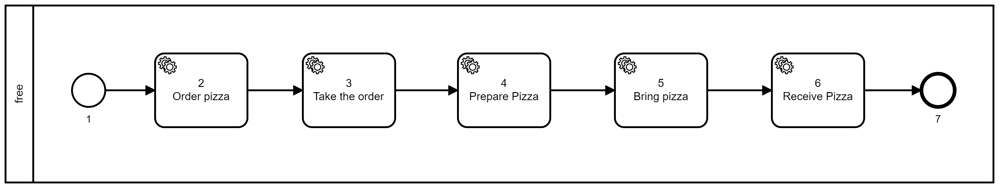

# Processo de pedir Pizza V1

## Diagrama



## Descrição

Esse exemplo mostra a primeira versão de um processo do pedido de uma pizza.

- Nó 1: O processo sempre é iniciado num [nó](/docs/resources/blueprints) do tipo [Start](/docs/resources/nodes/startNode). 
  Nesse caso, não há parâmetros pré-definidos para esse nó.


- Nó 2: Nó do tipo [System Task](/docs/resources/nodes/systemTaskNode) e da categoria [Set To Bag](/docs/resources/nodes/systemTaskNode#settobag). Esse nó
  irá guardar as informações do pedido da pizza para que possam
  ser utilizados em outros nós posteriormente. Os [parâmetros](/docs/resources/blueprints)
  são as variáveis "client", que irá receber o valor contido na
  "bag.name", o "client1"; a variável "pizzas", que será um objeto com
  quantidade ("qty"), sabores ("flavors") e sem azeitona ("olives": false)


- Nó 3: Nó do tipo [System Task](/docs/resources/nodes/systemTaskNode) e da categoria [Set To Bag](/docs/resources/nodes/systemTaskNode#settobag). Irá guardar na bag o número do pedido ("orderNo"). Nesse caso é interessante ressaltar
  que é possível utilizar funções do Javascript dentro do nó.


- Nó 4: Nó do tipo [System Task](/docs/resources/nodes/systemTaskNode) e da categoria [Timer](/docs/resources/nodes/systemTaskNode#timer). Esse nó
  representa o tempo de espera para o preparo da pizza, conforme
  visto na variável "timeout", dentro dos parâmetros.


- Nó 5: Nó do tipo [System Task](/docs/resources/nodes/systemTaskNode) e da categoria [Set To Bag](/docs/resources/nodes/systemTaskNode#settobag). Esse nó
  representa a entrega da pizza, e irá checar a quantidade de pizzas
  declaradas na variável "bag.pizza.qty", que será colocada em um
  comentário ("comment"), dentro do parâmetro do nó.


- Nó 6: Nó do tipo [System Task](/docs/resources/nodes/systemTaskNode) e da categoria [Set To Bag](/docs/resources/nodes/systemTaskNode#settobag). 
Esse nó representa o ato de receber a pizza e tem como
[parâmetro](/docs/resources/blueprints) a variável "confirm" que recebe o número do pedido
como valor "bag.orderNo".


- Nó 7: Nó final do tipo [Finish Node](/docs/resources/nodes/finishNode). Nesse nó, a chave "next"
  sempre receberá um valor "null".

## Blueprint

```js title="pizzaV1.json"
{
  "name": "pizza1",
  "description": "pizza1 blueprint example, only systemTasks",
  "blueprint_spec": {
    "requirements": ["core"],
    "prepare": [],
    "nodes": [
      {
        "id": "1",
        "type": "Start",
        "name": "Start Pizza 1 WF",
        "next": "2",
        "parameters": {
          "input_schema": {}
        },
        "lane_id": "1"
      },
      {
        "id": "2",
        "type": "SystemTask",
        "name": "Order Pizza",
        "category": "setToBag",
        "next": "3",
        "lane_id": "1",
        "parameters": {
          "input": {
            "client": { "$ref": "bag.name" },
            "client1": "teste",
            "pizzas": {
              "qty": 2,
              "flavors": ["mussarela", "pepperoni"],
              "olives": false
            }
          }
        }
      },
      {
        "id": "3",
        "type": "SystemTask",
        "name": "Take the order",
        "category": "setToBag",
        "next": "4",
        "lane_id": "1",
        "parameters": {
          "input": {
            "orderNo": { "$js": "() => Math.floor(Math.random() * 100); " }
          }
        }
      },
      {
        "id": "4",
        "type": "SystemTask",
        "name": "Prepare Pizza",
        "category": "Timer",
        "next": "5",
        "lane_id": "1",
        "parameters": {
          "input": {},
          "timeout": 5
        }
      },
      {
        "id": "5",
        "type": "SystemTask",
        "category": "SetToBag",
        "name": "Bring Pizza",
        "next": "6",
        "lane_id": "1",
        "parameters": {
          "input": {
            "comment": {
              "$mustache": "check if there are {{bag.pizzas.qty}} pizzas in the bag"
            }
          }
        }
      },
      {
        "id": "6",
        "type": "SystemTask",
        "category": "setToBag",
        "name": "Receive Pizza",
        "next": "7",
        "lane_id": "1",
        "parameters": {
          "input": {
            "confirm": { "$ref": "bag.orderNo" }
          }
        }
      },
      {
        "id": "7",
        "type": "Finish",
        "name": "Finish node",
        "next": null,
        "lane_id": "1"
      }
    ],
    "lanes": [
      {
        "id": "1",
        "name": "the_only_lane",
        "rule": ["fn", ["&", "args"], true]
      }
    ],
    "environment": {}
  }
}
```

