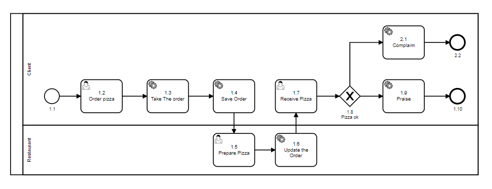

# ID do caminho + Sequência numérica

Nesta regra a nomeação segue uma sequência numérica com a inclusão de um prefixo para identificar o caminho
feliz e as possíveis derivações. 

Nesse tipo de nomeação fica claro qual o caminho esperado, facilitando a sua leitura. Também mantém a simplicidade de escrita. 
Mas possui a desvatagem da dificuldade de manutenção do diagrama devido a necessidade de nomeação do nós subsequentes 
sempre que se acrescentar um novo nó. 

No exemplo abaixo podemos ver como utilizar a regra. 
Foi escolhido id=1 para o caminho esperado e id=2 para o outro caminho possível.

