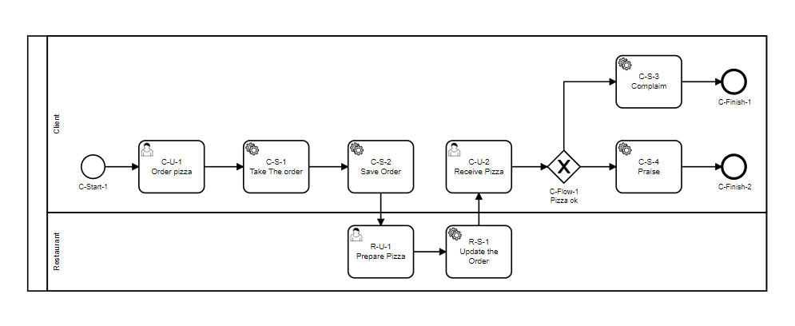

# ID Lane + ID Tipo de nó + Sequência numérica

Busca criar, através do id uma coordenada cartesiana do nó (lane = Y, sequencia = X).
Funciona para fluxo pouco ramificados. Identificação rápida quando lido pela blueprint.
A principal desvantagem e a codificação longa e bastante vinculada a características da tarefa.

