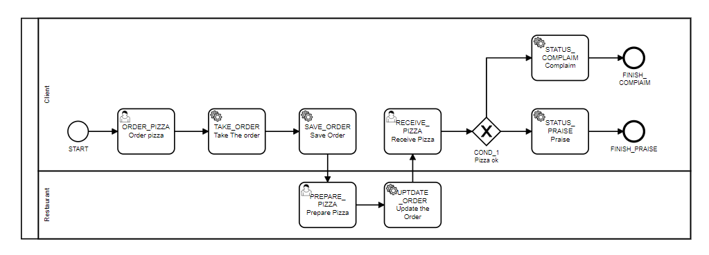

O id tem relação direta com a função que o nó possui no modelo de negócio.
Facilita os testes pois fica fácil identificar onde se encontra o processo. 

Para escrever é necessário um bom entendimento do negócio para não gerar confusão. 

