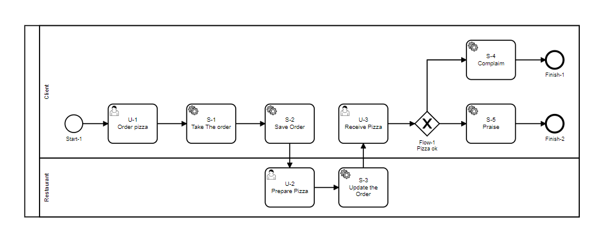

# ID Tipo de nó + Sequência numérica

Nesse caso o prefixo prioriza o tipo de nó e a sequência numérica está relacionada ao tipo de nó e não ao processo.
Funciona com fluxos muito ramificados, onde não existem caminhos bem definidos ou há muito entrelaçamento de ramos.
Esse tipo de sequenciamento pode gerar confusão de négocio.  

