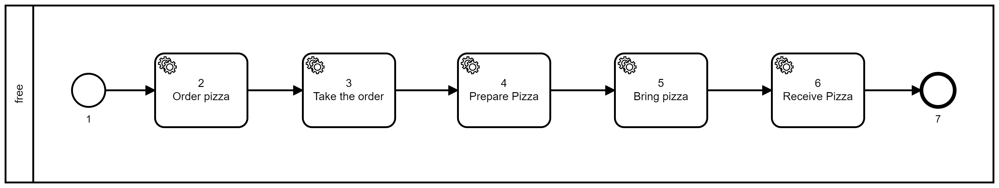

# Sequência numérica

Uma das formas simples de nomear é por sequência numérica.

É de simples entendimento e diminui muito o risco de nós com mesmo nome.

Nesse modo basta nomear numericamente seguindo o fluxo do caminho.

Como mostrado no exemplo a seguir. 

A desvatagem de nomear dessa maneira é que em fluxos com flownodes ela não se aplica.
Pois, não há uma única sequência. Sendo necessária adaptações que fazem com que se perca o padrão.
Como podemos notar no exemplo abaixo.

Outra desvatagem, é que sempre que for necessario acrescentar um novo nó será necessário nomear os nós subsequentes. 
è Recomendado que se utilize a sequência numérica apenas em diagramas simples. 