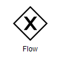

import Tabs from '@theme/Tabs';
import TabItem from '@theme/TabItem';


Nó de fluxo. 

No BPMN, trata-se de um gateway exclusivo.

## Parâmetros

O flowNode espera em seus parâmentros um único atributo que representa o valor que será utilizado para direcionamento do processo.

O valor atribuído será convertido em texto e comparado com as opções descritas no objeto *next* descrito no especificação do nó.

Caso o atributo especificado nos parameters não esteja definido, o flowNode gerará o texto *undefined* para comparação.


:::info
A comparação do parâmetro de input com os resultado é case-sensitive.
:::

## Next

Diferente dos demais nós do flowBuild, o atributo *next* de um flowNode é representado por um objeto e não por uma string.

Este objeto deve ser um conjunto de atributos que serão avaliados contra o valor do parâmetro especificado.

É obrigatório que um dos atributos do objeto *next* do flowNode seja *default*, que será utilizado caso nenhum resultado seja identificado.

<Tabs
  defaultValue="diagram"
  values={[
    {label: 'Schema', value: 'schema'},
    {label: 'Example', value: 'example'},
    {label: 'Symbol', value: 'diagram'},
  ]
}>
<TabItem value="schema">

```json
{
  "id": "any_string ",
  "name": "any string",
  "next": {
    "string": "other_node_id",
    "default": "other_node_id"
  },
  "type": "flow",
  "lane_id": "any_lane_id",
  "parameters": {
    "input": {
      "key": "string"
    }
  }
}
```
</TabItem>
<TabItem value="example">

```json
{
   "id":"9",
   "type":"Flow",
   "name":"Is User Registered?",
   "lane_id":"1",
   "next":{
      "default":"10",
      "201":"11",
      "206":"11"
   },
   "parameters":{
      "input":{
         "decision":{
            "$ref":"bag.registerUserResponse.status"
         }
      }
   }
}
```

</TabItem>
<TabItem value="diagram">



</TabItem>
</Tabs>


