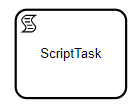

import Tabs from '@theme/Tabs';
import TabItem from '@theme/TabItem';

Nó de script é o nó capaz de executar um script.

:::caution
O uso de scriptNodes não é uma prática recomendada para execução de processos em ambiente de produção.
:::

## Parâmetros

O scriptNode espera 2 atributos
+ input
+ script

### Input

É representado por um objeto, com os atributos se entrada do script.

### Script

Representa a função LISP de deverá ser executada.


<Tabs
  defaultValue="diagram"
  values={[
    {label: 'Schema', value: 'schema'},
    {label: 'Example', value: 'example'},
    {label: 'Symbol', value: 'diagram'},
  ]
}>
<TabItem value="schema">

```json
{
  "id": "any_string (system friendly recommended)",
  "name": "any string",
  "type": "ScriptTask",
  "lane_id": "any_lane_id",
  "next": "other_node_id"
  "parameters":{
     input:{},
     script:{}
  }
}
```
</TabItem>
<TabItem value="example">

```json
{
   "id":"4",
   "name":"Script task node",
   "next":"5",
   "type":"ScriptTask",
   "lane_id":"1",
   "parameters":{
      "input":{
         "features":{
            "$ref":"result.data.features"
         }
      },
      "script":{
         "function":[
            "fn",
            [
               "input",
               "&",
               "args"
            ],
            [
               "js",
               [
                  "str",
                  [
                     "`",
                     "let features = "
                  ],
                  [
                     "get",
                     "input",
                     [
                        "`",
                        "features"
                     ]
                  ],
                  [
                     "`",
                     "; let result = {}; let is_istantor_on =
features.find(feature => feature.name === 'instantor'); result.is_istantor_on =
Boolean(is_istantor_on); result;"
                  ]
               ]
            ]
         ]
      }
   }
```

</TabItem>
<TabItem value="diagram">



</TabItem>
</Tabs>


