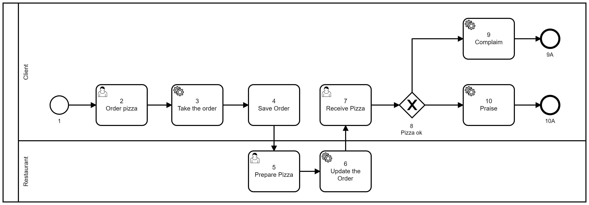

# Escrevendo o primeiro workflow

Antes de escrever qualquer blueprint, tenha em mãos o diagrama do processo. Utilize um tempo para revisar o diagrama de ter claro os casos de uso lá descritos e o entendimento de cada tarefa do processo.

É normal que, durante a *transcrição* do diagrama em um arquivo JSON, alguns nós adicionais venham a ser necessários, razão pela qual recomendamos evitar a utilização de valores numéricos para identificação de tarefas.

Para esse tutorial, utilizaremos como base o diagrama da pizza 2.



Para escrever seu arquivo JSON, utilize o editor de texto de sua preferência, recomendamos o uso de editores com suporte e validação de JSON, alguns exemplos são listados [aqui](../resources/references).

## 1o Nível

Defina o primeiro nível de propriedades: name, description e blueprint_spec.

Em geral recomenda-se que o campo name seja um texto *system-friendly*, ou seja, sem espaços e caracteres especiais e não demasiadamente comprido. 

O campo description trata-se de um campo mais livre, um texo *user-friendly* com uma explicação sucinta do processo.

O campo blueprint_spec, por enquanto fica como um objeto vazio.

```json title=Nivel 1
{
  "name": "tutorial",
  "description": "meu primeiro flowBuild",
  "blueprint_spec": {}
}
```

## blueprint_spec

O primeiro passo e definir as propriedades fixas da blueprint, que são:
- requirements: utilizaremos o pacote **core** para esta blueprint
- prepare: não faremos nenhuma preparação especial
- environment: não utilizaremos nenhuma variável de ambiente neste caso

```json title=blueprint_spec
{
  "name": "tutorial",
  "description": "meu primeiro flowBuild",
  "blueprint_spec": {
    "requirements": ["core"],
    "prepare": [],
    "environment": {}
  }
}
```

### Lane

Neste início, utilizaremos uma lane sem qualquer restriçãoo que significa que basta um token válido para podermos acessar a lane.

A função que rege o acesso da lane deve ser uma função que retorna um boleano, escrita em [LISP](../resources/references) ou em Javascript. Nesse caso utilizaremos uma função que retorna sempre o valor ```true```.

Assim como o workflow, as lanes tem um id, que recomenda-se utilizar um texto *system-friendly* e um name que é um texto mais livre, *user-friendly*.

```json title=blueprint_spec
{
  "id": "anyone",
  "name": "qualquer um pode acessar",
  "rule": ["fn", ["&", "args"], true]
}
```

Com isso, o JSON de nossa blueprint fica assim:

```json title=blueprint_spec
{
  "name": "tutorial",
  "description": "meu primeiro flowBuild",
  "blueprint_spec": {
    "requirements": ["core"],
    "prepare": [],
    "environment": {},
    "lanes": [{
      "id": "anyone",
      "name": "qualquer um pode acessar",
      "rule": ["fn", ["&", "args"], true]
    }]
  }
}
```

### Nós

Agora começamos a escrever os nós de nossa blueprint.

O primeiro nó que incluiremos será o nó de início do processo. Assim como os outros elementos, ele tem um id e um name, que segue a mesma orientação dada anteriormente.

Em casos de processos com um único startNode, é comum utilizar o termo *0* no id, por se simples e representar de forma clara o conceito de início.

### Publicação

Temos agora uma primeira versão da nossa blueprint, estamos prontos para sua publicação.

Para publicar, utilizaremos a API de [publicação de workflows](../resources/api/workflows).

```php title=Request
curl --location --request POST '3.82.154.55:3000/workflows' \
--header 'content: application/json' \
--header 'Content-Type: application/json' \
--header 'Authorization: Bearer {seu token}' \
--data-raw '{sua blueprint}'
```